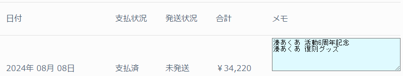

# Holo Shop Relaxer

[hololive production OFFICIAL SHOP](https://shop.hololivepro.com/)のアカウントページを分かりやすくするChrome拡張機能

## 機能

- MY PAGEの注文履歴の各項目にメモ欄を追加します。
  - メモ欄には注文に関するメモを自由に記述できます。
  - 注文ページ(/account/orders/番号)を開いたとき、メモ欄が空欄の場合は商品名一覧をセットします。
- MY PAGEの現在のページ番号を強調表示します。(オマケ機能)

## 導入手順

デベロッパー モードを有効にして入れる場合、以下の手順で導入できます。

> note
>
> 注意: Chrome ウェブストアを経由しないため、導入は自己責任でお願いします。

- `Code`ボタンを押し`Download ZIP`を選択する
- ダウンロードしたzipファイルを展開する
- Google Chromeのメニューから`[拡張機能]-[拡張機能を管理]`を開く
  - アドレスバーから`chrome://extensions/`を開いてもOK
- 画面右上の`デベロッパー モード`を有効にする
- `パッケージ化されていない拡張機能を読み込む`ボタンを押す
- 展開したフォルダの中の`src`フォルダを選択する
